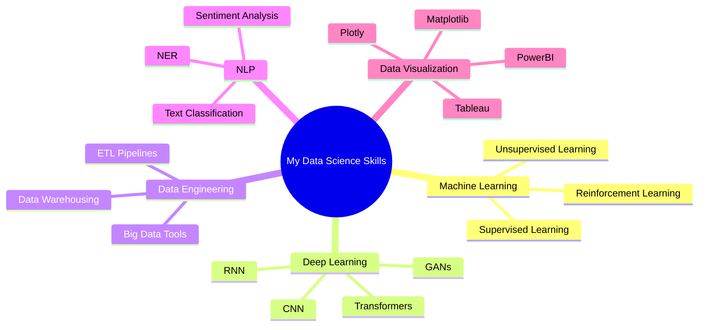

  

<h1 align="center">Hi , I'm Muhammed Sarfras</h1>
<h3 align="center">🔍 Data Scientist & ML Engineer from Kerala, India 🌟</h3>

  
  
  

## 💫 About Me

- 🔭 Currently working on **Deep Learning & NLP Projects**
- 🧠 Research interests in **Computer Vision and Predictive Analytics**
- 🌱 Learning **MLOps, Advanced Deep Learning, and Big Data Technologies**
- 👨‍💻 Experienced in building **end-to-end ML pipelines**
- 📊 Passionate about **data visualization & storytelling**
- 🤝 Looking to collaborate on **innovative AI solutions**
- ⚡ Fun fact: **I can explain complex ML concepts using everyday analogies**

## 🛠️ Data Science & ML Arsenal

<table>
  <tr>
    <td align="center" width="96">
      
       Python
    </td>
    <td align="center" width="96">
      
       Jupyter
    </td>
    <td align="center" width="96">
      
       TensorFlow
    </td>
    <td align="center" width="96">
      
       PyTorch
    </td>
    <td align="center" width="96">
      
       Pandas
    </td>
    <td align="center" width="96">
      
       NumPy
    </td>
  </tr>
  <tr>
    <td align="center" width="96">
      
       PostgreSQL
    </td>
    <td align="center" width="96">
      
       AWS
    </td>
    <td align="center" width="96">
      
       Docker
    </td>
    <td align="center" width="96">
      
       Git
    </td>
    <td align="center" width="96">
      
       Scikit-Learn
    </td>
    <td align="center" width="96">
      
       Seaborn
    </td>
  </tr>
</table>

## 🧪 ML Specializations

## 📫 Connect With Me

  
  
  

## 🌐 Portfolio & Projects

  
  

## 📈 Data Science Projects

| Project | Tech Stack | Domain | Link |
|---------|------------|--------|------|

## 📊 GitHub Stats

  

  

  

---

  
  

